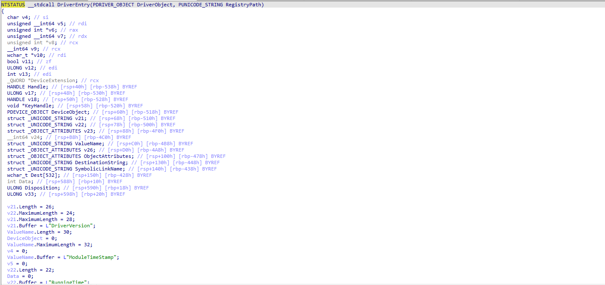
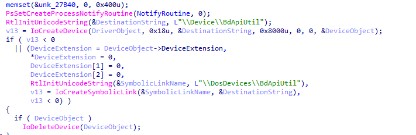
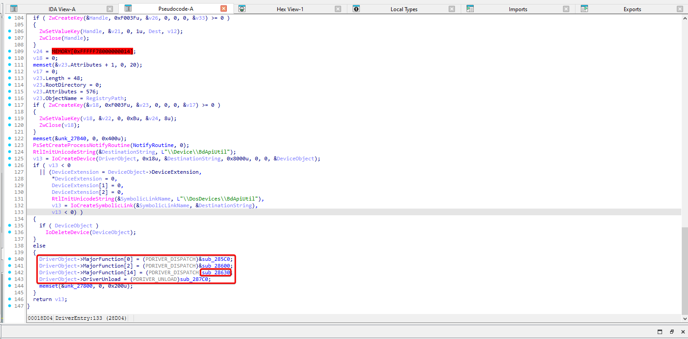
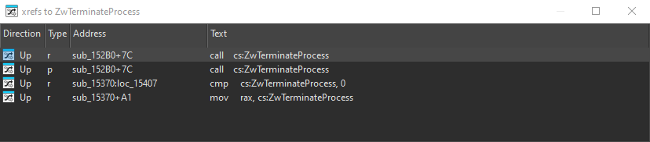
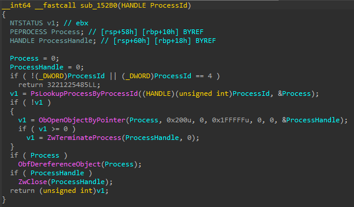
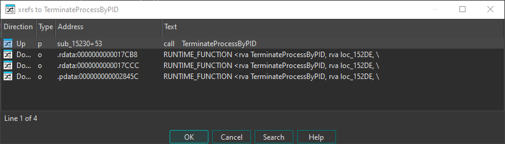
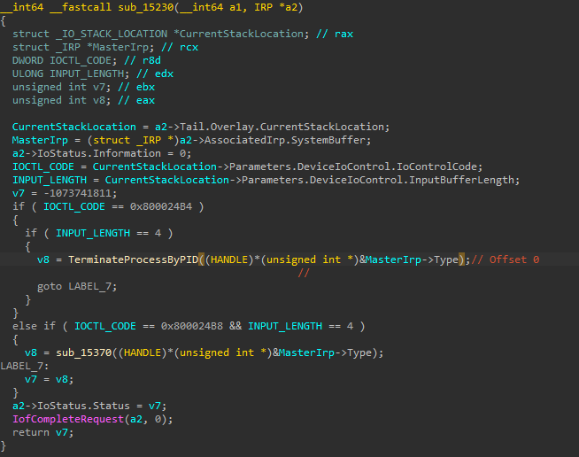
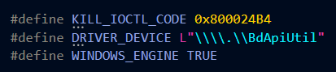
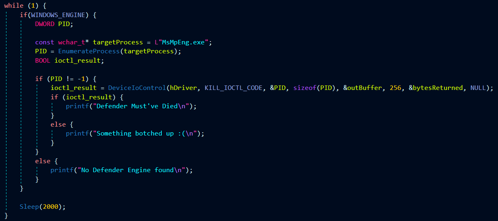

# BdApiUtil

BdApiUtil.sys was decompiled and opened up in IDA Free

In the DriverEntry Function, the device name and symlink were identified 

| Key | Value |
|---|---|
| Device Name | \\\\Device\\BdApiUtil |
| SymLink| \\\\DosDevices\\BdApiUtil |

Further Below, the function that handles IOCTL Requests (IOControlRoutine) is also found to be `sub_28630`

Now, we can start working backwards from `ZwTerminateProcess`. Only one cross reference to ZwTerminateProcess could be found in the driver, making things super easy for us.

The function having the cross reference for ZwTerminateProcess is examined and found to take the ProcessID as an arguement to spot it and kill it as long as it is not a system(PID 4) process.

The function was marked as `TerminateProcessByPID` and Cross References to it were listed. the function only gets called at one point in another function.

On examination, it turns out that the function is the same as the one handling IOCTL Requests, but has a lot of type errors which need to fixed fr IOCTL Requests. After fixes, its clear how we can trigger the `TerminateProcessByPID` Function.

| Key | Value |
| --- | ----- |
| IOCTL Code | 0x800024B4 |
| Payload | PID as Integer (4 Bytes) |

# EDRKiller
 In the [EDRKiller template](../EDRKiller.zip), the following can be updated  
 

Since the IOCTL packet shall only have the PId as an integer, we dont really need to pad anything

The EDR Killer is ready :)