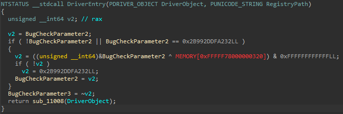
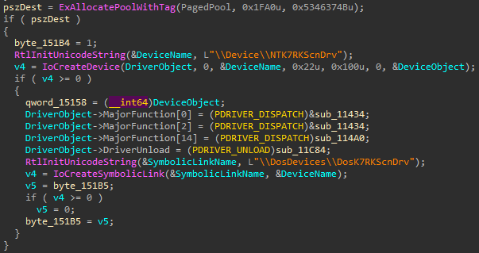
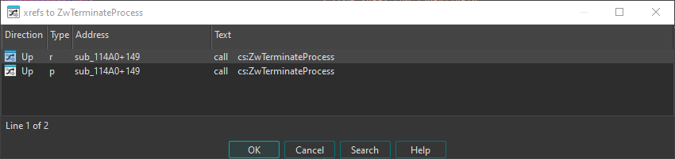
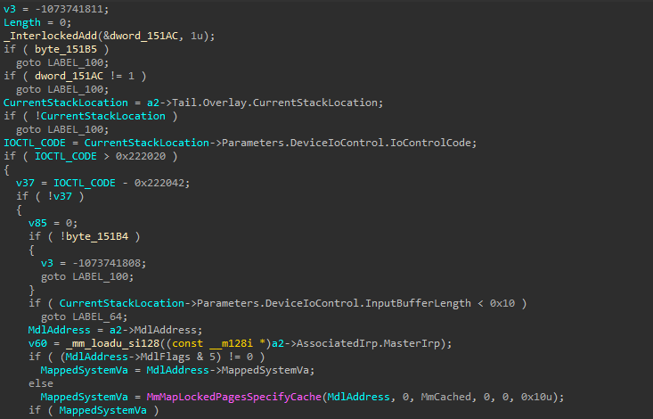
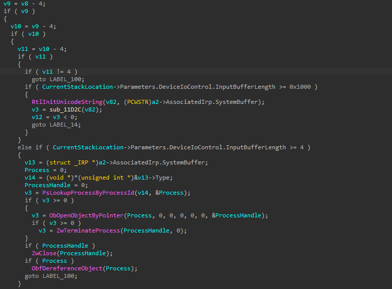
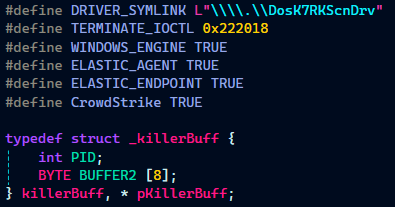
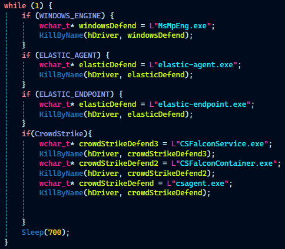

# K7RKScan

K7RKScan.sys was decompiled and opened up in IDA Free<br>


The main Driver Entry seemed to be handed off to `sub_11008`.
In the DriverEntry Function, the device name and symlink were identified <br>


| Key | Value |
|---|---|
| Device Name | \\\\Device\\NTK7RKScnDrv |
| SymLink| \\\\DosDevices\\DosK7RKScnDrv |

Furthermore, the function that handles IOCTL Requests (IOControlRoutine) is also found to be `sub_114A0`.<hr>


Now, we can start working backwards from `ZwTerminateProcess`. Only one cross reference to ZwTerminateProcess could be found in the driver, making things super easy for us.


The function having the cross reference for ZwTerminateProcess is examined and found be the IOControlRoutine. The decompilation has a lot of type errors, which can be easily corrected.<br>


The function has many conditionals which divert control flow based on the IOCTL Code and some variables. Moreover, it was found that the handler basically takes the buffer and kills that process.<br>


Based on the values of the variables tracing back to the `IOCTL_CODE` variable, for the `ZwTerminateProcess` sequence to carry out, the following needs to be true.
```
v11 = 0
v10 = 4
v9  = 8
v8  = 12
v7  = 16  --> 0x10
IOCTL_CODE = 0x222018
```

| Key | Value |
| --- | ----- |
| IOCTL Code | 0x222018 |
| Payload | PID as Integer (4 Bytes) |

# EDRKiller
 In the [EDRKiller template](../EDRKiller.zip), the following can be updated. Since the IOCTL packet needs to be of size >=4 , lets just pad for good measure. <br> 
 



The EDR Killer is ready :)