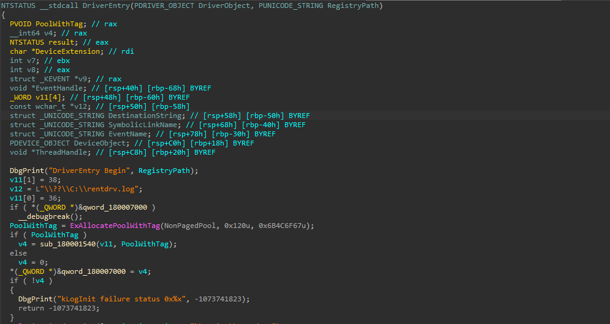
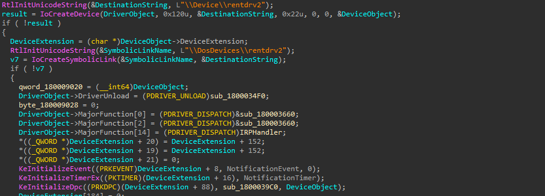
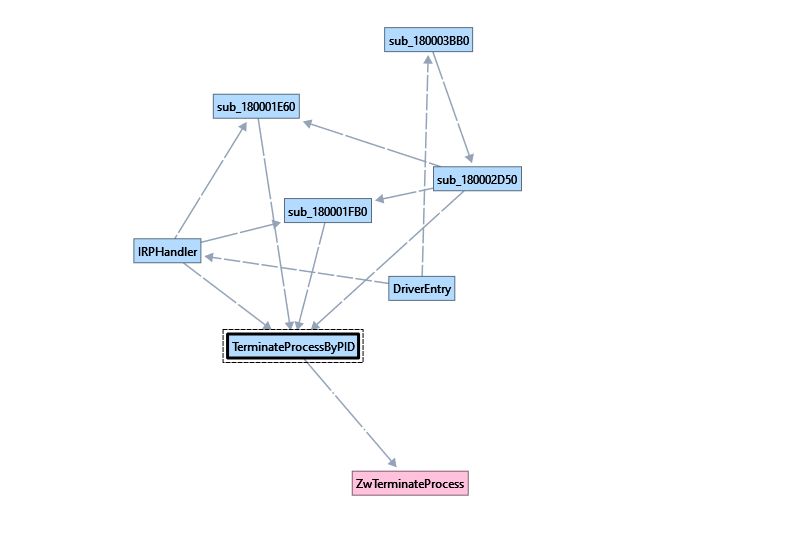
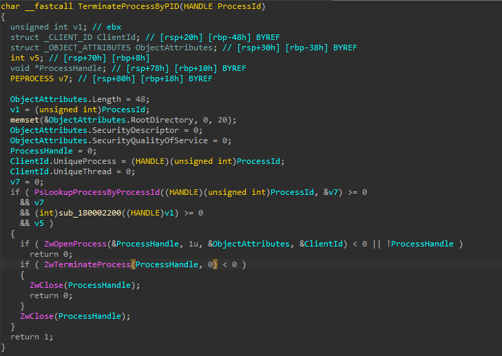
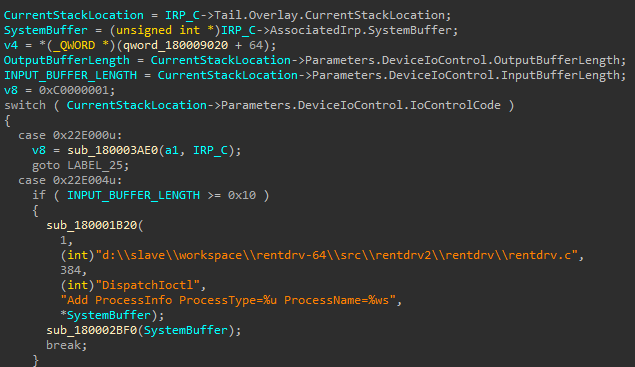
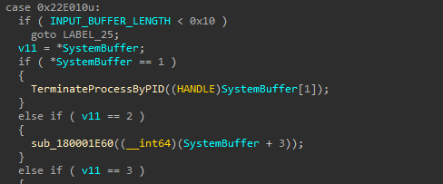
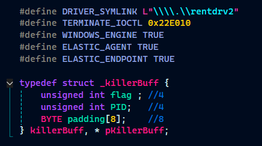
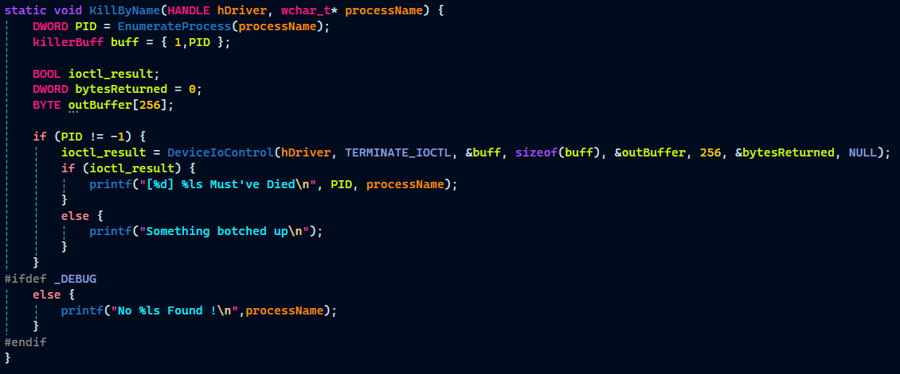

# rentdrv2.sys

rentdrv2.sys was decompiled and opened up in IDA Free 

Upon analysing the DriverEntry function, the device anme and symbolic link names were identified and a function was identified as handling the IRP packets, subsequently named `IRPHandler`. 

| Key | Value |
|---|---|
| Device Name | \\\\Device\\rentdrv2 |
| SymLink| \\\\DosDevices\\rentdrv2 |

I searched through the Imports section of the Driver to look for API that may be misused for provisioning an EDRKiller. It was observed that the rentdrv2.sys driver had ZwTerminateProcess listed as an import and was being used somewhere by the IRPHandler. The intermediary subroutines were hence analysed and named based on their attributes and actions. 

The subroutine TerminateProcessByPID, was aptly named due to the argument, `ProcessID` being eventually passed to the ZwOpenProcess API call which opens a handle to a process and the obtained handle is then passed to the ZwTerminateProcess API call, effectively killing the process with the PID passed as `ProcessID`.  

The control flow would go from the IRPHandler directly to TerminateProcessByPID only if a few conditions are met. 

Therefore, the IOCTL_CODE has to be `0x22E010`, the first four bytes should have the integer 1, the next 4 should have the PId and there should be atleast an 8 Byte padding to make the payload >=`0x10` thats `16 bytes`. 

| Key | Value |
| --- | ----- |
| IOCTL Code | 0x22E010 |
| Payload | { Int Flag{=1}; Int PID; BYTE padding[8]; }  |

# EDRKiller
 In the [EDRKiller template](../EDRKiller.zip), the following can be updated  
 

The EDR Killer is ready :)