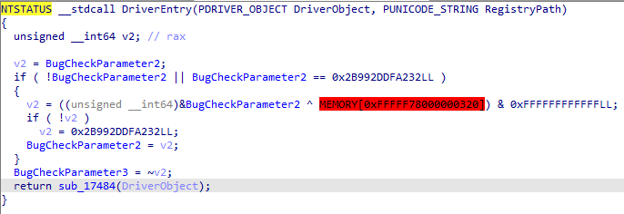
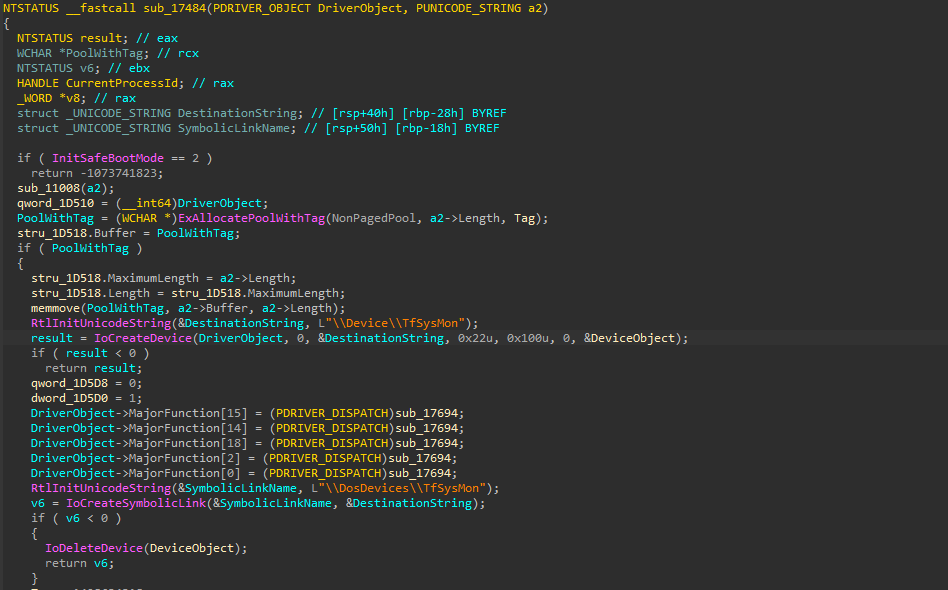
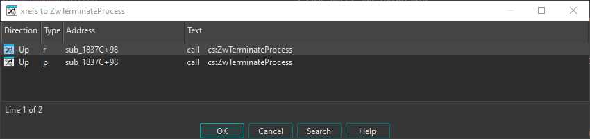
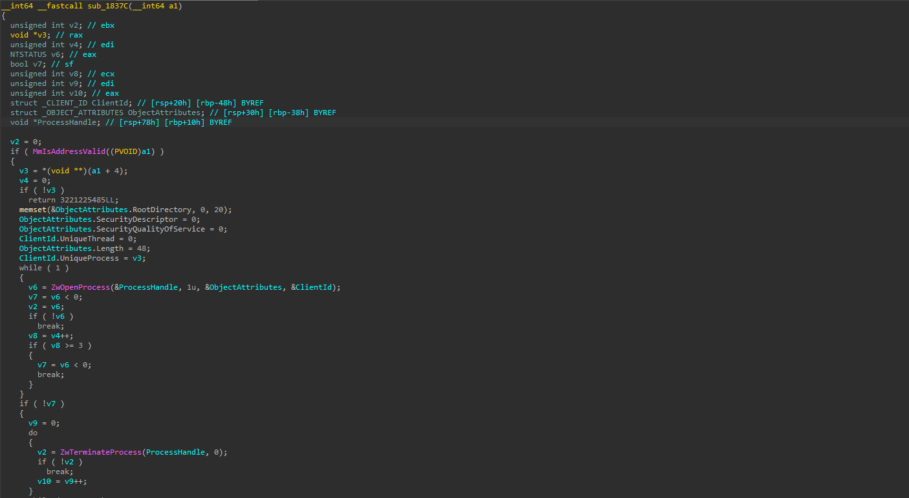
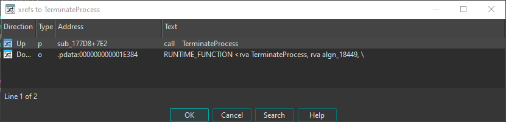
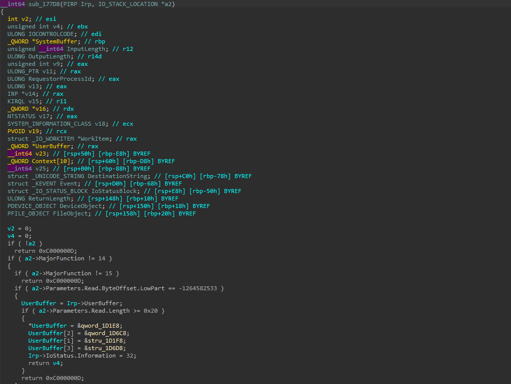
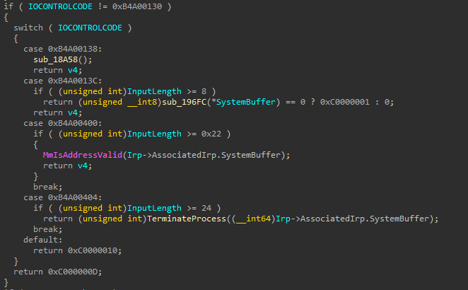
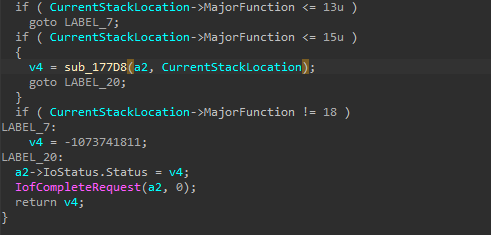
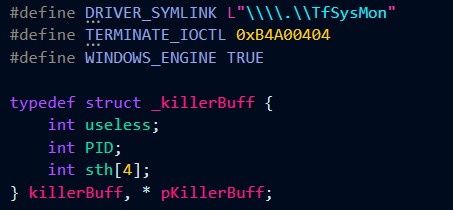
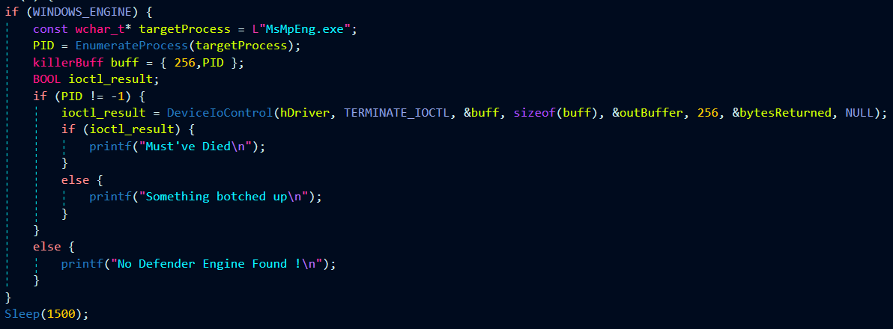

# TfSysMon

SysMon.sys was decompiled and opened up in IDA Free  

The DriverObject was passed to a different function `sub_17484`. We can assume that all the activity happens within that function. The DeviceName, SymLink and the IOControlRoutine was found from `sub_17848` 

|  |  |
|--|--|
| DriverName| \\\\Device\\TfSysMon|
| SymLink| \\\\DosDevices\\TfSysMon |
|IoControlRoutine|sub_17694|

Now we work backwards from ZwTerminateProcess. The call is only made within once function, `sub_1837C` 

The function is fairly straightforward, it performs the following actions:
- Check if the arguement passed to it is at a valid address
- Obtain handle to a process using part of the payload as the PID (unsigned integer starting from offset +4)
- If opening the process does not end up in an error, (i.e. v6 = 0 --> v7 is boolean false) then try 3 times to terminate the process using the handle recieved from the `ZwOpenProcess` call. 

The function is renamed as `TerminateProcess` 

Only one xref is found, which is within  `sub_177D8`  

The function has many wrongly tagged data types which need to be fixed, but it clearly handles IOCTL requests based on the xrefs it is called from.  

The IOCTL code and Payload type can be discovered from where the `TerminateProcess` function is being called within `sub_177D8`  

|  |  |
|--|--|
|IOCTL Code| 0xB4A00404 |
|Payload| Size more than 24, PID as an unsigned integer starting from the +4 offset |

This is so, since the System Buffer is directly passed to the TerminateProcess function.

Note: From the IOControlRoutine(`sub_17694`), we can see where and how the `sub_177D8` is called and how it is basically as if the `sub_177D8` was the IOControlRoutine function instead of `sub_17694` 

# EDRKiller

The following changes can be made in the [EDRKiller Template](../EDRKiller.zip)  

Rest its just about populating it and passing the data to the driver  

Note: The killerBuff can also work with byte padding instead of integer padding, its just about proper offset of +4 and total size more than equal to 24.

The EDRKiller is ready :)