# wsftprm

wsftprm.sys was decompiled and opened up in IDA Free<br>
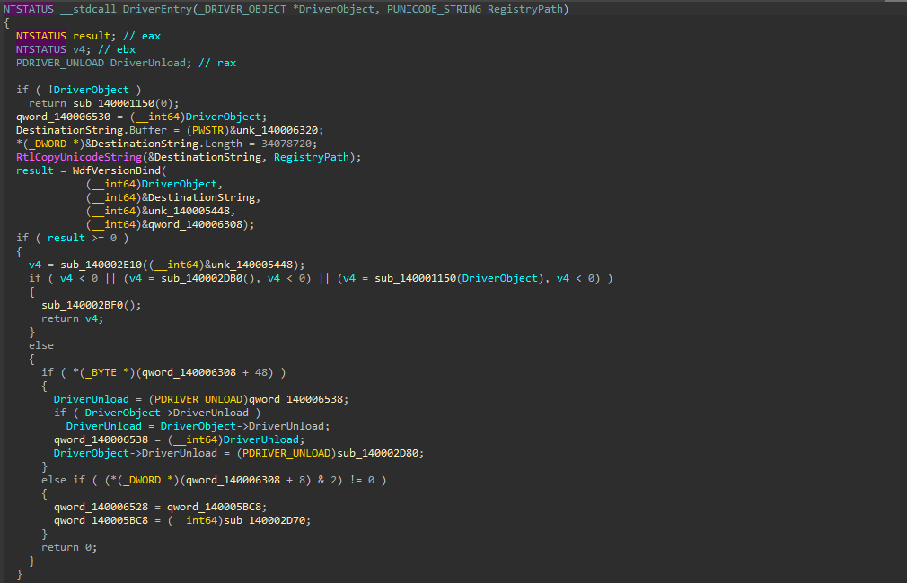

Upon analysing the DriverEntry function, it was observed that, as per the decompiled source code, the DriverObject is handed over to the subroutine `sub_140001150` under certain conditions. All other branched of conditional statements did not seem pertinent to the development of an EDRKiller and hence were not explored extensively. The subroutine `sub_140001150` was subsequently renamed as DriverLoad.<br>
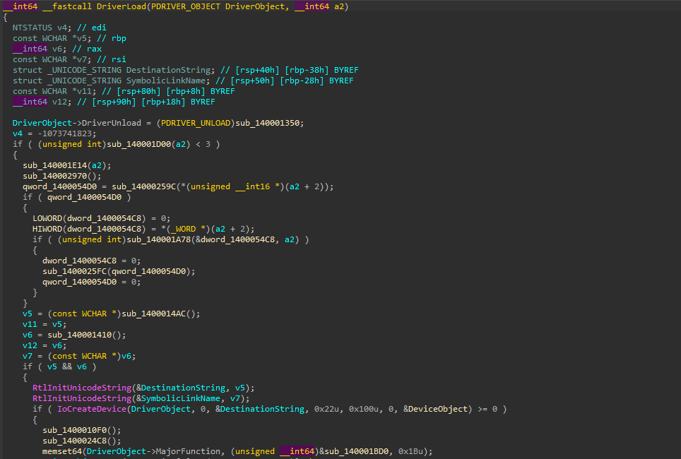

The DriverLoad was analyzed, and the section of the code exposing the Symbolic Name and assigning the function to `IRP_MJ_DEVICE_CONTROL` can be seen below.<br>
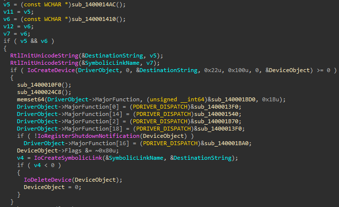 

I observed that a variable `v5` was holding a value assigned by the subroutine `sub_1400014AC` (subsequently named getDeviceName), and the variable DestinationString further being assigned that value and a device being create using the same. 

Upon successful creation, the subroutine `sub_140001540`(subsequently named IRPHandler) is assigned to be the function that handles IRP packets (`IRP_MJ_DEVICE_CONTROL`) as well as a Symbolic Link is created using the variable SymbolicLinkName storing the Unicode string eventually derived from the variable v6. The variable `v6` holds a value assigned by the function `sub_140001410` (subsequently named getSymLinkName). 

The subroutines getDeviceName and getSymLinkName were functions developed to hide the name of SymLink and Device.<br>

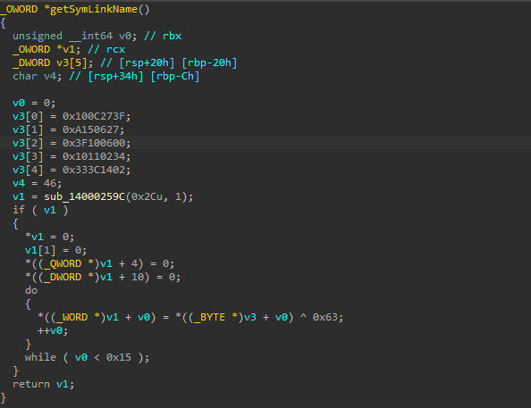
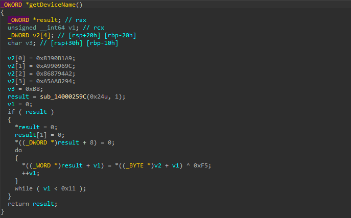

Reverse engineering them was pretty straightfoward. ChatGPT was pretty quick with it.

| Key | Value |
|---|---|
| Device Name | \\\\Device\\Warsaw_PM |
| SymLink| \\\\DosDevices\\Warsaw_PM |

I searched through the Imports section of the Driver to look for API that may be misused for provisioning an EDRKiller. It was observed that the wsftprm.sys driver had ZwTerminateProcess listed as an import and was being used somewhere by the IRPHandler. The intermediary subroutines were hence analysed and named based on their attributes and actions.<br>

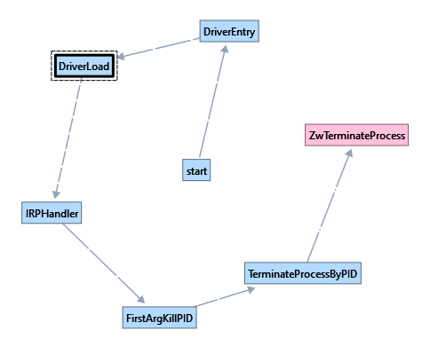
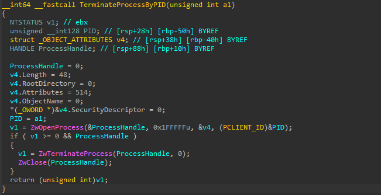

The subroutine TerminateProcessByPID, was aptly named due to the argument, `a1` being eventually passed to the ZwOpenProcess API call which opens a handle to a process and the obtained handle is then passed to the ZwTerminateProcess API call, effectively killing the process with the PID passed as `a1`. <br>
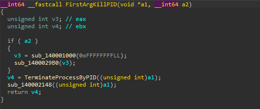

The subroutine FirstArgKillPid, was aptly named due to the first argument `a1`, being passed to the subroutine TerminateProcessByPID in all circumstances. To get from IRPHandler to FirstArgKillPID, the IRP Handler function was analyzed and the following conditional was observed: <br>
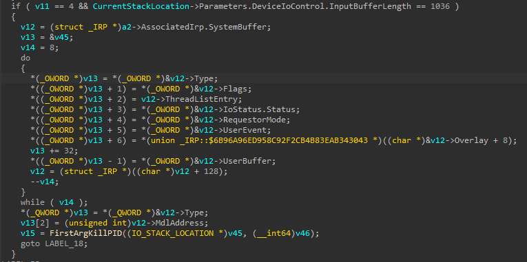

This conditional passes the control flow to the FirstArgKillPid function when the variable `v11` is four and the length of the buffer sent is exactly `1036 bytes`. Moreover, the variable `v45` which is passed to the FirstArgKillPid subroutine gets populated by the `v13` pointer using the SystemBuffer(`v12`) provided by the user in an IRP packet. 

As per the source code, `v11` will take the value 4 when the following are true: 

```
v11 = 4 
v11 = v10 – 0x10 
v10 = v9 – 4 
v9 = v8 – 4 
v8 = IOCTL_CODE – 0x222000 
```
Therefore, the IOCTL_CODE has to be `0x22201C`. 

| Key | Value |
| --- | ----- |
| IOCTL Code | 0x22201C |
| Payload | { Int PID; BYTE padding[1032]; }  |

# EDRKiller
 In the [EDRKiller template](../EDRKiller.zip), the following can be updated<br> 
 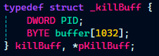

Since the IOCTL packet shall have the PID as an integer at offset +0, we dont really need to pad anything before it. and the rest will automatically be initialised as zero.<br>
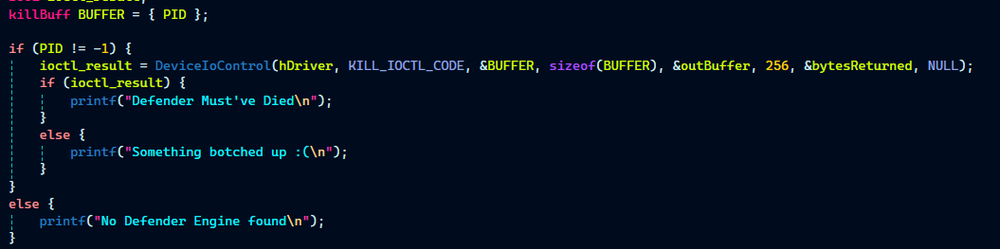

The EDR Killer is ready :)